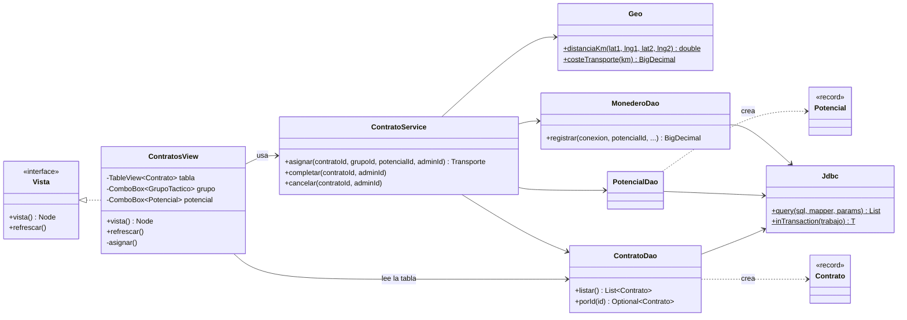

Guía para entender el proyecto desde cero. El flujo activo es la web; los capítulos de JavaFX describen únicamente el código legacy que se conserva en Git.

> Consejo: ten abierto el proyecto en el IDE mientras lees. Cada vez que aparezca una ruta como `core/.../ContratoService.java`, ábrela y busca lo que se explica.

## 1. La idea en un minuto
La web pública y la gestión administrativa comparten el mismo backend y la misma base de datos:
```
    Gestión web (HTML/JS)             API (Java)                 MySQL                 Web pública
    login + resumen              ──▶  valida/consulta  ──▶   sf_archive   ──▶  feed y mapa
    admin y potenciales              JDBC                                            ciudadanos
```

- **La gestión web** ofrece el login y el panel administrativo en HTML, CSS y JavaScript.
- **La web pública** enseña los datos publicados y permite enviar avisos anónimos.
- La **API** conecta de forma segura con MySQL; el navegador nunca se conecta directamente a la base de datos.

El código JavaFX se conserva en `archive-app/desktop-admin` como legado. La interfaz activa está en `archive-web/public`; el panel web actual tiene login, sesión y estadísticas. Las pantallas avanzadas de JavaFX aún no se han migrado.

---

## 2. Preparar el ordenador

### 2.1 Lista de lo que necesitas

| # | Herramienta | ¿Obligatoria? | Para qué |
| --- | --- | --- | --- |
| 1 | **JDK 21** | ✅ Sí | Compilar y ejecutar Java |
| 2 | **IntelliJ IDEA Community** (o NetBeans) | ✅ Sí | Escribir y ejecutar el código (trae Maven dentro) |
| 3 | **MySQL Server Community 8** (o MariaDB) | ✅ Sí | La base de datos local |
| 4 | **Git** | ✅ Sí | Descargar el proyecto y subir cambios |
| 5 | **Scene Builder** | Recomendada | Diseñar pantallas FXML (clase) |
| 6 | **MySQL Workbench** | Recomendada | Conectar al servidor y ejecutar los scripts SQL |
| 7 | **Maven** suelto | Opcional | Solo si quieres usar `mvn` desde la terminal |
| 8 | Navegador (Chrome, Firefox, Edge) | ✅ Sí | Ver la web |

Las instrucciones son para **Windows** (lo normal en clase). En Mac/Linux los pasos son equivalentes.

### 2.2 JDK 21 (Java)

1. Entra en **https://adoptium.net** → elige *Temurin 21 (LTS)* → *Windows x64* → descarga el **`.msi`**.
2. Ejecútalo. En la pantalla de opciones, marca:
   - ✅ **Set JAVA_HOME variable**
   - ✅ **Add to PATH**
3. Comprueba: abre una terminal nueva (tecla Windows → escribe `cmd`) y escribe:
   ```
   java -version
   ```
   Debe decir `openjdk version "21...`. Si sale otra versión (por ejemplo 17), es que tienes varias instaladas: desinstala la vieja o revisa `JAVA_HOME` en *Variables de entorno*.

> ¿Por qué 21? El proyecto usa `record`, `switch` moderno y text blocks, que necesitan Java 17+, y JavaFX 21.

### 2.3 IntelliJ IDEA Community

1. **https://www.jetbrains.com/idea/download** → **Community Edition** (gratis) → instalar con las opciones por defecto.
   (Con el correo del instituto puedes pedir la *Ultimate* gratis como estudiante, pero no hace falta.)
2. Abre el proyecto: *File → Open* → elige la carpeta **`archive-app`** (la que tiene el `pom.xml` padre) → *Trust Project*.
3. Abajo a la derecha verás que descarga dependencias ("Resolving Maven dependencies…"). La primera vez tarda unos minutos: está bajando JavaFX, Javalin, el driver de MySQL…
4. Comprueba el JDK: *File → Project Structure → Project → SDK* = **21**. Si no aparece, *Add SDK → JDK* y elige la carpeta de Temurin (`C:\Program Files\Eclipse Adoptium\jdk-21...`).

**Maven** ya viene dentro de IntelliJ: lo tienes en el panel lateral derecho (icono **m**). No hace falta instalarlo aparte.

> ¿Usas NetBeans? *File → Open Project* → `archive-app`. NetBeans también entiende Maven sin instalar nada.

### 2.4 MySQL Server Community 8

Descarga **MySQL Installer Community** desde [dev.mysql.com/downloads/installer](https://dev.mysql.com/downloads/installer/). Si ya existe el servicio `MySQL80`, no instales otra instancia encima: abre `services.msc` y arráncalo. Si estás configurando una instalación nueva:

1. En *Setup Type*, elige `Server Only` si solo necesitas la base de datos, o `Developer Default` si también vas a instalar Workbench.
2. En *Type and Networking*, elige `Development Computer`. Mantén `TCP/IP` activado, el puerto `3306`, y deja `Named Pipe` y `Shared Memory` desactivados. Si la conexión será solo desde este PC, desmarca *Open Windows Firewall ports for network access*.
3. En *Authentication Method*, conserva la opción recomendada. En *Accounts and Roles*, crea una contraseña para `root`, confírmala y guárdala; no es la contraseña de la app.
4. En *Windows Service*, usa el nombre `MySQL80`, activa *Start the MySQL Server at System Startup* y aplica la configuración.
5. Comprueba que el servicio está en ejecución: `Win + R` → `services.msc` → `MySQL80` → estado **En ejecución**.

El servicio `MySQL80` debe usar el puerto `3306`, que es el que tiene configurado el proyecto. Si ya hay otro programa ocupando ese puerto, detén esa instancia antes de iniciar este servidor.

**Alternativa:** XAMPP incluye MariaDB, compatible con este proyecto; inicia `MySQL` desde el panel de XAMPP. No ejecutes simultáneamente MySQL80 y XAMPP en el mismo puerto.

### 2.5 Git

1. **https://git-scm.com/download/win** → instalar con opciones por defecto.
2. Configúralo una vez:
   ```
   git config --global user.name "Nina"
   git config --global user.email "tu-correo@ejemplo.com"
   ```
3. Descarga el proyecto:
   ```
   cd C:\Users\Nina\Documents
   git clone https://github.com/MarinaDP2006/SanFranciscoArchivoSobrenatural.git
   ```
   (O desde IntelliJ: *File → New → Project from Version Control* → pega la URL.)

### 2.6 Scene Builder

1. **https://gluonhq.com/products/scene-builder/** → descarga la versión para **Java 21** (Windows Installer) → instalar.
2. Conéctalo con IntelliJ: *File → Settings → Languages & Frameworks → JavaFX* → *Path to SceneBuilder* → `C:\Users\<tu usuario>\AppData\Local\SceneBuilder\SceneBuilder.exe`.
3. Ahora, con clic derecho sobre cualquier `.fxml` → **Open in SceneBuilder**.

### 2.7 MySQL Workbench

Instálalo desde [dev.mysql.com/downloads/workbench](https://dev.mysql.com/downloads/workbench/), o selecciónalo en *MySQL Installer → Add*. Para crear una conexión:

1. Pulsa **+** junto a *MySQL Connections* y ponle el nombre `SFA local`.
2. Usa *Hostname* `127.0.0.1`, *Port* `3306`, *Username* `root`; pulsa **Store in Vault** para guardar localmente la contraseña de root y después **Test Connection**.
3. Abre `database/01_schema.sql` con *File → Open SQL Script* y ejecútalo con el icono del rayo. Luego abre y ejecuta `database/02_datos.sql`.

**Importante:** `01_schema.sql` contiene `DROP DATABASE`: elimina y vuelve a crear `sf_archive`. Úsalo solo para una instalación nueva o cuando aceptes borrar la BD. Si la base ya existe, no lo ejecutes; usa `database/03_permisos_login_web.sql` para aplicar los permisos del login sin tocar datos. Workbench debe mostrar `Query OK` al terminar.

### 2.8 Maven en la terminal (opcional)

Solo si quieres escribir `mvn ...` en `cmd` para compilar y ejecutar la API:
1. https://maven.apache.org/download.cgi → *Binary zip archive* → descomprímelo en `C:\maven`.
2. *Variables de entorno* → `Path` → *Nuevo* → `C:\maven\bin`.
3. Terminal nueva → `mvn -version`.

Si no lo instalas, compila el backend desde el panel **Maven** de IntelliJ.

### 2.9 Si usas `root` en lugar de los usuarios del proyecto

El script `01_schema.sql` crea los usuarios MySQL `sfa_admin` y `sfa_web`. Si prefieres entrar con `root` (lo típico en XAMPP), edita `archive-app/core/src/main/resources/archive.properties`:
```properties
db.user=root
db.password=
api.db.user=root
api.db.password=
```
(Deja la contraseña vacía si tu `root` no tiene; si la tiene, escríbela.)

### 2.10 Comprobación final

| Comprobación | Resultado esperado |
| --- | --- |
| `java -version` | `21.x` |
| `services.msc` → `MySQL80` | En ejecución |
| Workbench → `SFA local` → Test Connection | Connection succeeded |
| IntelliJ → panel Maven → `archive-app` | Se ven los módulos del backend sin errores rojos |
| http://localhost/phpmyadmin | Abre (si arrancaste Apache) |

Si todo está bien, sigue con la sección 3. 🎉

---

## 3. Arrancar todo paso a paso

### 3.1 Crear la base de datos
Inicia el servicio `MySQL80` y abre la conexión `SFA local` en Workbench. Para una base nueva, ejecuta `database/01_schema.sql` y después `database/02_datos.sql`. Para una base existente, ejecuta `database/03_permisos_login_web.sql`; no vuelvas a ejecutar el esquema destructivo.

También puedes ejecutar los scripts desde PowerShell o CMD si está instalado el cliente `mysql` y el directorio `bin` de MySQL está en `PATH`:
```bash
mysql -u root -p < database/01_schema.sql
mysql -u root -p < database/02_datos.sql
```

Comprueba en Workbench que existe `sf_archive` y sus tablas. No vuelvas a ejecutar `01_schema.sql` para solucionar un error si quieres conservar los datos: ese script borra la base completa.

### 3.2 Arrancar la API y la web

Desde la carpeta raíz del repositorio, compila la API y arráncala:
```bash
mvn -f archive-app/pom.xml -pl api-web -am package -DskipTests
java -jar archive-app/api-web/target/sfa-api.jar
```

La API sirve también los archivos de `archive-web/public` en `http://localhost:8080`.

### 3.3 Entrar en la gestión web

Abre `http://localhost:8080/admin-login.html` e inicia sesión con una cuenta activa de la base de datos. El README y la interfaz no muestran contraseñas. Después del login se abre el panel de estadísticas. Comprueba también `http://localhost:8080/api/salud`: debe responder `"baseDatos":"CONECTADA"`. Si el login devuelve un error, ejecuta `database/03_permisos_login_web.sql` en Workbench y revisa la salida de la terminal de la API.

### 3.4 La prueba de fuego
1. Con la web abierta, ve a la app → **Incidentes** → elige uno sin publicar (p. ej. *Secuestran a un anciano en Japantown*).
2. Marca **Publicado en la web** → **Guardar**.
3. Espera ≤30 s mirando la web: aparece en el feed y en el mapa.

Y al revés: en la web → **Pedir ayuda** → envía un aviso → en la app → **Avisos ciudadanos** → ahí está.

---

## 4. Mapa de carpetas
```
archive-app/
├── pom.xml                         ← "padre" Maven: versiones de Java, JavaFX, librerías
├── core/                           ← lo COMÚN (lo usan la app y la API)
│   └── src/main/java/com/sfarchive/core/
│       ├── model/                  ← las "fichas": Incidente, Potencial, Contrato... (records y enums)
│       ├── db/                     ← conexión a MySQL (Config, Database, Jdbc)
│       ├── dao/                    ← SQL: leer/guardar cada tabla (IncidenteDao, ContratoDao...)
│       ├── service/                ← reglas del negocio (asignar contrato, pagar, máx. 6 por grupo...)
│       └── security/               ← cifrado de contraseñas
│   └── src/main/resources/archive.properties  ← usuario/contraseña de MySQL
├── desktop-admin/                  ← la APP JavaFX
│   └── src/main/java/com/sfarchive/desktop/
│       ├── ArchiveApp.java         ← el main de JavaFX (start, Stage, Scene)
│       ├── Launcher.java           ← main "puente" para el .jar/.exe
│       ├── Sesion.java             ← quién ha iniciado sesión
│       ├── ui/                     ← ayudantes: Ui (tablas, botones, diálogos), Formulario, MapaFx
│       └── views/                  ← UNA CLASE POR PANTALLA (LoginView, ContratosView...)
│   └── src/main/resources/com/sfarchive/desktop/tema.css  ← los colores (CSS de JavaFX)
└── api-web/                        ← la API (Javalin) que alimenta la web
    └── src/main/java/com/sfarchive/api/ (ApiServer.java, WebDao.java)

archive-web/public/                 ← la WEB: index.html, ayuda.html... + css/ + js/
database/                           ← los dos scripts SQL
```

**Regla de oro:** si quieres cambiar…
- **qué se guarda** → `database/` + `model/` + `dao/`
- **qué se permite hacer** → `service/`
- **cómo se ve en la app** → `views/` + `tema.css`
- **cómo se ve en la web** → `archive-web/public/`

### 4.1 Clase por clase

Hay **77 clases**, pero no te asustes: casi todas siguen el mismo patrón. Por paquetes:

#### `core` → `com.sfarchive.core.db` (conexión)

| Clase | Qué hace |
| --- | --- |
| `Config` | Lee `archive.properties` (y variables de entorno) para saber a qué MySQL conectarse |
| `Database` | Crea el *pool* de conexiones (HikariCP) y da conexiones con `Database.connection()` |
| `Jdbc` | Ayudante para no repetir JDBC: `query`, `one`, `insert`, `update`, `inTransaction` |
| `DataException` | Excepción con un mensaje "para humanos" (la muestran las pantallas en un diálogo) |

#### `core` → `com.sfarchive.core.model` (los datos)

**Records** (una ficha de cada cosa, una por tabla):

| Record | Tabla | Representa |
| --- | --- | --- |
| `Usuario` | `usuarios` | Cuenta de acceso (admin o potencial) |
| `Potencial` | `potenciales` | Agente con habilidad, nivel, estado, grupo y saldo |
| `GrupoTactico` | `grupos_tacticos` | Grupo por país/zona (incluye cuántos miembros tiene) |
| `Vinculo` | `vinculos_familiares` | Familiar de un potencial |
| `Incidente` | `incidentes` | Suceso: parte pública + anomalía clasificada |
| `SolicitudAyuda` | `solicitudes_ayuda` | Aviso anónimo de un ciudadano |
| `Contrato` | `contratos` | Encargo para resolver un incidente (con datos del incidente, grupo y potencial ya unidos) |
| `Transaccion` | `transacciones_monedero` | Movimiento del monedero |
| `Informe` | `informes_clasificados` | Informe final del Archivo Restringido |
| `Noticia` | `noticias` | Noticia de la web |
| `ZonaSegura` | `zonas_seguras` | Punto verde del mapa |
| `Actividad` | `registro_actividad` | Línea del registro de auditoría |

**Enums** (valores fijos, iguales que los `ENUM` de MySQL): `Rol`, `TipoIncidente`, `EstadoIncidente`, `OrigenIncidente`, `EstadoContrato`, `Prioridad`, `EstadoPotencial`, `TipoTransaccion`, `Clasificacion`, `CategoriaNoticia`, `TipoZona`, `EstadoSolicitud`.

#### `core` → `com.sfarchive.core.dao` (el SQL)

Una clase por tabla. Todas tienen un método `map(ResultSet)` que convierte una fila en un record, y métodos tipo `listar()`, `porId()`, `guardar()`, `borrar()`.

| DAO | Métodos destacados |
| --- | --- |
| `UsuarioDao` | `porUsername`, `hashDe` (para el login), `cambiarHash`, `registrarAcceso` |
| `PotencialDao` | `listar`, `porGrupo` (con `null` = sin grupo), `cambiarGrupo`, `cambiarEstado` |
| `GrupoDao` | `listar` (con número de miembros), `guardar`; constante `MAX_MIEMBROS = 6` |
| `VinculoDao` | `porPotencial`, `guardar`, `borrar` |
| `IncidenteDao` | `listar`, `crear` (genera el código `SFA-2026-021`), `sinContratoActivo`, `setPublicado` |
| `SolicitudDao` | `crear` (genera el código `SF-XXXXXX`), `porCodigo`, `actualizarEstado` |
| `ContratoDao` | `listar`, `porEstado`, `porPotencial`, `cerrados`, `crear` (código `CTR-2026-017`) |
| `MonederoDao` | `historial`, **`registrar`** (suma/resta y guarda el movimiento, bloqueando la fila) |
| `InformeDao` | `porContrato`, `guardar` (inserta o actualiza) |
| `NoticiaDao` | `listar`, `guardar` (crea el *slug* de la URL), `slugify` |
| `ZonaSeguraDao` | `listar`, `guardar`, `borrar` |
| `ActividadDao` | `registrar` (auditoría), `recientes` |
| `EstadisticasDao` | Contadores para el Dashboard |

#### `core` → `com.sfarchive.core.service` (las reglas)

| Servicio | Reglas que aplica |
| --- | --- |
| `AuthService` | Login (usuario activo + contraseña correcta), cambiar y restablecer contraseña |
| `ContratoService` | **Ciclo del contrato**: crear, `asignar` (comprueba grupo y disponibilidad, calcula transporte), `iniciar`, `reportarFinalizacion`, `completar` (paga), `marcarFallido`, `cancelar` (reembolsa) |
| `Geo` | Distancia entre coordenadas (Haversine) y coste de transporte |
| `GrupoService` | Mover potenciales entre grupos (máximo 6) |
| `MonederoService` | Ajustes manuales (bonus suma, penalización resta) |
| `PotencialService` | Reclutar (crea la cuenta + la ficha + fondo inicial) y editar |
| `SolicitudService` | Convertir un aviso en incidente + contrato, ponerlo en revisión o descartarlo |

#### `core` → `com.sfarchive.core.security`

| Clase | Qué hace |
| --- | --- |
| `PasswordHasher` | `hash(password)`, `verify(password, hash)` y `validarFortaleza` (mín. 8, letras y números) |

#### `desktop-admin` → `com.sfarchive.desktop` (la app)

| Clase | Qué hace |
| --- | --- |
| `Launcher` | `main` "puente" (necesario para el `.jar`/`.exe`); llama a `ArchiveApp.main` |
| `ArchiveApp` | Extiende `Application`: crea la ventana, carga `tema.css` y cambia entre login y principal |
| `Sesion` | Guarda el usuario que ha entrado (`Sesion.esAdmin()`, `Sesion.potencialId()`…) |
| `ui.Ui` | Ayudantes: columnas de tabla, botones, tarjetas KPI, diálogos, `Ui.ejecutar` (captura errores) |
| `ui.Formulario` | Rejilla etiqueta + campo (`GridPane`) y lectura segura de números |
| `ui.MapaFx` | Mapa Leaflet dentro de un `WebView` |

**Pantallas** (`views`), todas implementan `Vista`:

| Pantalla | Quién la ve | Para qué |
| --- | --- | --- |
| `LoginView` | Todos | Iniciar sesión |
| `MainView` | Todos | Menú lateral (distinto según el rol) + zona central |
| `DashboardView` | Admin | Resumen, tabla de incidentes y mapa |
| `IncidentesView` | Admin | Crear/editar/publicar incidentes |
| `SolicitudesView` | Admin | Avisos que llegan desde la web |
| `ContratosView` | Admin | Asignar (grupo + potencial), completar, cancelar |
| `PotencialesView` + `VinculoDialog` | Admin | Fichas, reclutamiento y familiares |
| `GruposView` | Admin | Grupos y arrastrar miembros |
| `MonederosView` | Admin | Saldos e historial |
| `ArchivoRestringidoView` | Admin | Informes clasificados |
| `NoticiasView`, `ZonasView` | Admin | Contenido de la web |
| `UsuariosView` | Admin | Cuentas y auditoría |
| `MisMisionesView`, `MiMonederoView`, `MisVinculosView`, `ReportarView` | Potencial | Su trabajo diario |
| `PerfilView` | Todos | Cambiar contraseña |

#### `api-web` → `com.sfarchive.api`

| Clase | Qué hace |
| --- | --- |
| `ApiServer` | Arranca Javalin, define las rutas `/api/...`, CORS, errores y sirve la web |
| `WebDao` | Consultas de solo lectura sobre las **vistas públicas** (nunca ve la anomalía) |

### 4.2 Diagrama de clases (lo esencial)

GitHub dibuja este diagrama automáticamente:



Lee el diagrama de izquierda a derecha: **pantalla → servicio → DAO → Jdbc → MySQL**. Todas las demás pantallas siguen exactamente este dibujo cambiando los nombres.

---

## 5. Repaso de Java que usa el proyecto
Todo esto es Java "normal", solo que más moderno que el de 1.º. Si algo te suena raro, aquí está.

### 5.1 `record`: una clase de datos en una línea

`core/.../model/Vinculo.java`:
```java
public record Vinculo(int id, int potencialId, String nombre, String parentesco,
                      Integer edad, String ciudad, boolean conoceSecreto,
                      boolean enRiesgo, String notas) { }
```
Es lo mismo que una clase con atributos `private final`, constructor, getters, `equals`, `hashCode` y `toString`… pero escrito solo. **Diferencia importante:** los getters se llaman sin `get`:
```java
v.nombre();      // y NO v.getNombre()
```
Los records son **inmutables**: para "cambiar" uno se crea uno nuevo (lo verás en los formularios).

### 5.2 `enum`: listas cerradas de valores

`model/EstadoContrato.java`: `SOLICITADO, ASIGNADO, EN_CURSO, ...`. Coinciden **exactamente** con los `ENUM(...)` de MySQL. Para pasar de texto de la BD a enum:
```java
EstadoContrato e = EstadoContrato.valueOf(rs.getString("estado"));
```
Todos los enums tienen un método `etiqueta()` que convierte `EN_CURSO` en `En curso` para mostrarlo bonito.

### 5.3 Lambdas y referencias a métodos

```java
boton.setOnAction(e -> guardar());          // "cuando pulsen, ejecuta guardar()"
Ui.col("Alias", 90, Potencial::alias);      // "para esta columna, usa el método alias()"
```
`Potencial::alias` es una forma corta de escribir `p -> p.alias()`.

### 5.4 Streams: filtrar listas sin bucles

`DashboardView.filtrar()`:
```java
todos.stream()
     .filter(i -> i.estado() == EstadoIncidente.NO_VERIFICADO)
     .toList();
```
Equivale a un `for` con un `if` que va añadiendo a una lista nueva.

### 5.5 `Optional`: "puede que haya resultado, puede que no"

```java
Optional<Potencial> p = potencialDao.porId(7);
Potencial sombra = p.orElseThrow(() -> new DataException("Potencial no encontrado."));
```
Evita los `NullPointerException`: te obliga a pensar qué pasa si no existe.

### 5.6 Text blocks `"""`: SQL en varias líneas

```java
String sql = """
        SELECT p.*, g.nombre AS grupo_nombre
        FROM potenciales p
        LEFT JOIN grupos_tacticos g ON g.id = p.grupo_id
        """;
```
⚠️ Lección aprendida en este proyecto: Java **quita la sangría común** de los text blocks. Si concatenas `"... = ?" + """ ORDER BY..."""` puede quedar `?ORDER BY` pegado y MySQL da error de sintaxis. Por eso en `ContratoDao` el `ORDEN` empieza con un espacio explícito.

### 5.7 `switch` moderno

```java
BigDecimal valor = switch (tipo) {
    case BONUS -> importe.abs();
    case PENALIZACION -> importe.abs().negate();
    default -> importe;
};
```
(`MonederoService.ajustar`). Sin `break` y devuelve un valor.

### 5.8 `try-with-resources`

```java
try (Connection c = Database.connection()) {
    ...
} // aquí la conexión se cierra SOLA, aunque haya excepción
```

### 5.9 `BigDecimal` para el dinero

Nunca `double` para dinero (`0.1 + 0.2 = 0.30000000000000004`). Por eso los saldos son `BigDecimal` en Java y `DECIMAL(12,2)` en MySQL:
```java
saldo.add(importe);           // en vez de saldo + importe
importe.negate();             // en vez de -importe
```

---

## 6. La base de datos

Abre `database/01_schema.sql`: cada tabla tiene un comentario encima.

### 6.1 Las tablas y cómo se relacionan

```
usuarios ─1:1─ administradores
usuarios ─1:1─ potenciales ─N:1─ grupos_tacticos   (máx. 6 por grupo)
                potenciales ─1:N─ vinculos_familiares
                potenciales ─1:N─ transacciones_monedero
incidentes ─1:N─ contratos ─1:1─ informes_clasificados
solicitudes_ayuda ─N:1─ incidentes
noticias ─N:1─ incidentes
zonas_seguras · registro_actividad
```

- **Clave foránea** (`FOREIGN KEY`): `contratos.incidente_id` apunta a `incidentes.id`. MySQL no te deja poner un id que no exista.
- `ON DELETE CASCADE`: si borras un incidente, se borran sus contratos.
- `ON DELETE SET NULL`: si borras un grupo, sus potenciales quedan "sin grupo" (no se borran).

### 6.2 Las vistas: la "censura" de la web

```sql
CREATE VIEW v_incidentes_publicos AS
SELECT i.id, i.titulo, i.tipo, ...        -- ¡no incluye anomalia_clasificada!
FROM incidentes i
WHERE i.publicado = 1;
```
Una **vista** es una consulta guardada que se usa como si fuera una tabla. La API **solo** tiene permiso sobre las vistas (usuario MySQL `sfa_web`), así que aunque alguien hackeara la API **no podría leer la anomalía**. Seguridad por diseño.

### 6.3 El trigger del máximo de 6

```sql
CREATE TRIGGER trg_pot_grupo_max_upd BEFORE UPDATE ON potenciales
FOR EACH ROW
BEGIN
    IF ... (SELECT COUNT(*) FROM potenciales WHERE grupo_id = NEW.grupo_id) >= 6 THEN
        SIGNAL SQLSTATE '45000' SET MESSAGE_TEXT = 'Un grupo tactico no puede tener mas de 6 potenciales';
    END IF;
END
```
Un **trigger** se ejecuta solo antes/después de un INSERT/UPDATE/DELETE. Aunque alguien se salte la app y toque la BD a mano, la regla se cumple. `NEW` es la fila tal como va a quedar.

👉 **Pruébalo:** en Workbench ejecuta varias veces `UPDATE potenciales SET grupo_id = 3 WHERE id = X;` con distintos X y verás el error al llegar a 7.

### 6.4 Contraseñas

En `usuarios.password_hash` no está la contraseña, sino un **hash** (`pbkdf2_sha256$65536$sal$hash`). Al hacer login se calcula el hash de lo que escribes y se compara. Así, aunque roben la BD, no tienen las contraseñas. Código: `core/.../security/PasswordHasher.java`.

---

## 7. Hablar con MySQL desde Java (JDBC)

### 7.1 Dónde se configura la conexión

`core/src/main/resources/archive.properties`:
```properties
db.url=jdbc:mysql://localhost:3306/sf_archive?useUnicode=true&characterEncoding=UTF-8
db.user=sfa_admin
db.password=sfa_admin_2026
```
Si en clase usáis `root` sin contraseña, cámbialo aquí (o crea un `archive.properties` en `archive-app/` copiando `archive.properties.example`).

### 7.2 Lo que ya sabes de JDBC… y cómo lo simplifica el proyecto

En clase seguramente hacéis algo así:
```java
Connection c = DriverManager.getConnection(url, user, pass);
PreparedStatement ps = c.prepareStatement("SELECT * FROM potenciales WHERE id = ?");
ps.setInt(1, 7);
ResultSet rs = ps.executeQuery();
while (rs.next()) {
    String alias = rs.getString("alias");
    ...
}
rs.close(); ps.close(); c.close();
```
Eso está **una sola vez** en `core/.../db/Jdbc.java`, y los DAO lo usan así:
```java
// ZonaSeguraDao.java
public List<ZonaSegura> listar() {
    return Jdbc.query("SELECT * FROM zonas_seguras ORDER BY tipo, nombre", ZonaSeguraDao::map);
}

static ZonaSegura map(ResultSet rs) throws SQLException {   // convierte UNA fila en UN objeto
    return new ZonaSegura(rs.getInt("id"), rs.getString("nombre"), ...);
}
```
- `Jdbc.query(sql, mapper, parámetros...)` → lista de objetos
- `Jdbc.one(...)` → `Optional` con un objeto
- `Jdbc.update(...)` → UPDATE/DELETE
- `Jdbc.insert(...)` → INSERT y devuelve el id generado

Siempre con `?` (**PreparedStatement**): nunca concatenes texto del usuario en el SQL → evita la **inyección SQL**.

### 7.3 Transacciones: todo o nada

Asignar un contrato hace **5 cosas**: cambia el contrato, cambia el estado del potencial, descuenta el transporte del monedero, cambia el incidente y apunta en el registro. Si falla la 3.ª, **no puede quedar** el contrato asignado sin cobrar. Por eso:
```java
// ContratoService.asignar
return Jdbc.inTransaction(c -> {
    ... 5 operaciones usando la misma conexión c ...
    return t;
});
```
`inTransaction` hace `setAutoCommit(false)`, ejecuta todo, y al final `commit()`; si salta una excepción, `rollback()` y como si nada hubiera pasado.

### 7.4 HikariCP (el "pool")

Abrir una conexión a MySQL es lento. `Database.java` usa **HikariCP**, que mantiene unas cuantas abiertas y las presta. Para ti es transparente: `Database.connection()` y listo.

---

## 8. Las capas: modelo → DAO → servicio → pantalla

Sigamos **un clic** de principio a fin: el botón **ASIGNAR** en *Contratos*.

```
ContratosView.asignar()                     (desktop-admin/views)   ← PANTALLA
   │  lee el grupo y el potencial elegidos en los ComboBox
   ▼
ContratoService.asignar(contrato, grupo, potencial, admin)  (core/service)   ← REGLAS
   │  ¿el contrato está SOLICITADO? ¿el potencial es del grupo? ¿está DISPONIBLE?
   │  calcula distancia (Geo.distanciaKm) y coste (Geo.costeTransporte)
   ▼
ContratoDao / PotencialDao / MonederoDao     (core/dao)   ← SQL
   ▼
MySQL (contratos, potenciales, transacciones_monedero, incidentes, registro_actividad)
```

¿Por qué separarlo así?
- La **pantalla** no sabe SQL. Solo recoge datos y muestra resultados.
- El **servicio** no sabe de botones. Las reglas se pueden probar con tests (mira `core/src/test`).
- El **DAO** no decide nada: solo lee y escribe.

Si mañana hacéis una versión Android, reutilizáis `core` entero y solo cambiáis las pantallas. 😉

**Errores de negocio:** cuando una regla no se cumple, el servicio lanza `DataException("mensaje para el usuario")`. La pantalla la captura (con `Ui.ejecutar`) y muestra un diálogo. Por eso casi ningún método de las vistas tiene `try/catch`.

---

## 9. JavaFX: cómo están hechas las pantallas

### 9.1 Stage, Scene y el árbol de nodos

```
Stage  (la ventana)
 └── Scene  (el contenido de la ventana)
      └── BorderPane  (raíz)
           ├── left:   VBox con los botones del menú
           └── center: la pantalla actual (VBox con título, tabla, formulario...)
```
`ArchiveApp.start(Stage stage)` crea la ventana. Para cambiar de "pantalla" no se abren ventanas nuevas: se cambia la raíz (`scene.setRoot(...)`) o el centro del `BorderPane` (`raiz.setCenter(...)`, en `MainView`).

### 9.2 Pantallas hechas con código (no FXML)

En este proyecto las pantallas se construyen **en Java**, no con FXML. Es lo mismo que haría Scene Builder, pero a mano. Comparación:

| En Scene Builder arrastras… | En el código del proyecto |
| --- | --- |
| Un `VBox` | `new VBox(10, hijo1, hijo2)` (10 = separación) |
| Un `Button` con onAction | `Ui.boton("Guardar", this::guardar)` |
| Un `TextField` con fx:id | `private final TextField titulo = new TextField();` |
| Un `TableView` con columnas | `Ui.tabla(...)` + `Ui.col("Título", 260, Incidente::titulo)` |
| Un `SplitPane` | `new SplitPane(izquierda, derecha)` |
| Clase CSS en *Style Class* | `nodo.getStyleClass().add("panel")` |

Todas las pantallas implementan la interfaz `Vista` (`views/Vista.java`):
```java
public interface Vista {
    Node vista();                  // construye la pantalla (una sola vez)
    default void refrescar() { }   // vuelve a leer de la BD
}
```
`MainView` llama a `vista()` la primera vez que pulsas en el menú y a `refrescar()` cada vez.

### 9.3 Anatomía de una pantalla sencilla: `ZonasView`

Ábrela (`views/ZonasView.java`) y localiza estas partes:

1. **Atributos**: los DAO y los controles (`TextField nombre`, `ComboBox<TipoZona> tipo`…).
2. **`vista()`**: crea columnas de la tabla, el formulario y los botones; lo mete todo en un `SplitPane`.
3. **Listener de selección**:
   ```java
   tabla.getSelectionModel().selectedItemProperty().addListener((o, viejo, nuevo) -> {
       if (nuevo != null) mostrar(nuevo);
   });
   ```
   "Cuando cambie la fila seleccionada, rellena el formulario con ella."
4. **`mostrar(z)`**: pasa del objeto a los campos (`nombre.setText(z.nombre())`).
5. **`guardar()`**: pasa de los campos a un objeto nuevo y llama al DAO.
6. **`refrescar()`**: vuelve a cargar la tabla desde MySQL.

Este patrón **tabla a la izquierda + formulario a la derecha** se repite en casi todas las pantallas. Si entiendes `ZonasView`, entiendes el 80 %.

### 9.4 TableView: lo que más cuesta al principio

```java
TableColumn<ZonaSegura, String> col = new TableColumn<>("Nombre");
col.setCellValueFactory(cd -> new SimpleStringProperty(cd.getValue().nombre()));
```
"Para cada fila (`cd.getValue()` es la `ZonaSegura` de esa fila), muestra su nombre." `Ui.col(...)` hace exactamente eso por ti. `Ui.colBadge` pinta la etiqueta de colores y `Ui.colDinero` pone verde/rojo según el signo.

Para meter datos: `tabla.setItems(FXCollections.observableArrayList(lista))` (o `Ui.cargar(tabla, lista)`).

### 9.5 Diálogos

En `ui/Ui.java`: `Ui.info("...")`, `Ui.error("...")`, `Ui.confirmar("¿Seguro?")` (devuelve `true/false`) y `Ui.pedirTexto(...)`. Son `Alert` y `TextInputDialog` de JavaFX con el tema oscuro aplicado.

### 9.6 CSS de JavaFX

`desktop-admin/src/main/resources/com/sfarchive/desktop/tema.css`. Se parece al CSS web pero las propiedades empiezan por `-fx-`:
```css
.button.primario { -fx-background-color: #e8b04b; -fx-text-fill: #000000; }
```
Cambia `#e8b04b` por otro color, relanza la app y verás todos los botones principales cambiados.

### 9.7 El mapa dentro de la app

`ui/MapaFx.java` usa un **`WebView`** (un mini navegador dentro de JavaFX) donde carga Leaflet, la misma librería de mapas de la web. Desde Java se le pasa una lista de `Pin` (lat, lng, color, texto) y se genera el HTML.

### 9.8 Arrastrar y soltar

`GruposView.configurarLista(...)`: `setOnDragDetected` (empiezo a arrastrar → guardo el id del potencial), `setOnDragOver` (¿acepto lo que me traen?) y `setOnDragDropped` (lo suelto → `GrupoService.mover`). Es el ejemplo más avanzado de eventos de la app.

---

## 10. JavaFX con FXML y Scene Builder

En clase vais a trabajar con **FXML + Scene Builder + controlador**. Es otra forma de hacer **lo mismo** que se ha hecho aquí con código:

| | Con código (este proyecto) | Con FXML (clase) |
| --- | --- | --- |
| Diseño | Java (`new VBox(...)`) | Archivo `.fxml` (XML) que dibujas en Scene Builder |
| Lógica | La misma clase | Clase **controlador** con `@FXML` |
| Enlazar un control | Variable normal | `fx:id="titulo"` ↔ `@FXML private TextField titulo;` |
| Botón | `setOnAction(e -> guardar())` | `onAction="#guardar"` ↔ `@FXML private void guardar()` |

Ninguna es "mejor": FXML separa diseño y lógica y es más visual; el código es más fácil de reutilizar (por eso aquí hay ayudantes como `Ui.col`). **Pueden convivir** en el mismo proyecto.

### 10.1 Ejemplo: la pantalla de Zonas seguras hecha con FXML

Así quedaría el formulario de `ZonasView` si lo diseñaras en Scene Builder.

**1) `zonas.fxml`** (en `desktop-admin/src/main/resources/com/sfarchive/desktop/`):
```xml
<?xml version="1.0" encoding="UTF-8"?>
<?import javafx.scene.control.*?>
<?import javafx.scene.layout.*?>

<VBox spacing="10" styleClass="pantalla" xmlns:fx="http://javafx.com/fxml/1"
      fx:controller="com.sfarchive.desktop.controllers.ZonasController">
   <Label styleClass="titulo" text="Zonas seguras"/>
   <TableView fx:id="tabla" VBox.vgrow="ALWAYS">
      <columns>
         <TableColumn fx:id="colNombre" text="Nombre" prefWidth="250"/>
         <TableColumn fx:id="colBarrio" text="Barrio" prefWidth="120"/>
      </columns>
   </TableView>
   <TextField fx:id="nombre" promptText="Nombre"/>
   <TextField fx:id="lat" promptText="Latitud"/>
   <TextField fx:id="lng" promptText="Longitud"/>
   <Button text="Guardar" styleClass="primario" onAction="#guardar"/>
</VBox>
```

**2) `ZonasController.java`**:
```java
package com.sfarchive.desktop.controllers;

public class ZonasController {

    @FXML private TableView<ZonaSegura> tabla;           // mismo nombre que fx:id
    @FXML private TableColumn<ZonaSegura, String> colNombre;
    @FXML private TableColumn<ZonaSegura, String> colBarrio;
    @FXML private TextField nombre, lat, lng;

    private final ZonaSeguraDao dao = new ZonaSeguraDao(); // ¡reutilizamos el DAO de core!

    @FXML                        // JavaFX lo llama solo después de cargar el FXML
    private void initialize() {
        colNombre.setCellValueFactory(cd -> new SimpleStringProperty(cd.getValue().nombre()));
        colBarrio.setCellValueFactory(cd -> new SimpleStringProperty(cd.getValue().barrio()));
        tabla.setItems(FXCollections.observableArrayList(dao.listar()));
    }

    @FXML                        // onAction="#guardar"
    private void guardar() {
        dao.guardar(new ZonaSegura(0, nombre.getText(), TipoZona.REFUGIO, null, null,
                Double.parseDouble(lat.getText()), Double.parseDouble(lng.getText()), null, null, true));
        tabla.setItems(FXCollections.observableArrayList(dao.listar()));
    }
}
```

**3) Cargarlo** (por ejemplo desde una `Vista`):
```java
FXMLLoader loader = new FXMLLoader(ArchiveApp.class.getResource("zonas.fxml"));
Parent raiz = loader.load();
```

**4) Dependencia:** para usar FXML hay que añadir `javafx-fxml` al `desktop-admin/pom.xml` (junto a `javafx-controls`):
```xml
<dependency>
    <groupId>org.openjfx</groupId>
    <artifactId>javafx-fxml</artifactId>
    <version>${javafx.version}</version>
</dependency>
```

### 10.2 Trucos de Scene Builder

- **Abrir:** *File → Open* → tu `.fxml`. Panel izquierdo: *Library* (controles) y *Document → Hierarchy* (el árbol).
- **fx:id** y **On Action** están en el panel derecho → pestaña **Code**.
- **Controller class**: abajo a la izquierda, *Document → Controller*. Pon el nombre completo con paquete.
- **Ver con tu CSS:** *Preview → Scene Style Sheets → Add a Style Sheet…* → elige `tema.css`.
- **Plantilla del controlador:** *View → Show Sample Controller Skeleton* te genera los `@FXML` para copiar.
- Los errores típicos son `fx:id` mal escrito (atributo `null`) o el método de `onAction` que no existe o no lleva `@FXML`.

---

## 11. La API y la web: cómo la app actualiza la web

### 11.1 La API (`api-web/.../ApiServer.java`)

Usa **Javalin**, un mini-servidor web en Java. Cada ruta es una línea:
```java
app.get("/api/incidentes", ctx -> ctx.json(dao.incidentes(
        ctx.queryParam("tipo"), ctx.queryParam("barrio"), ctx.queryParam("q"))));
```
"Cuando alguien pida `GET /api/incidentes`, consulta MySQL y devuelve la lista convertida a **JSON**." El JSON es texto que JavaScript entiende directamente:
```json
[{"id":19,"codigo":"SFA-2026-019","titulo":"Secuestran a una mujer…","tipo":"SECUESTRO","lat":37.7642,"lng":-122.4271}]
```

### 11.2 La web (`archive-web/public/js/`)

| Archivo | Qué hace |
| --- | --- |
| `config.js` | Dónde está la API |
| `api.js` | `fetch` a la API (y la copia de demo si no hay conexión) |
| `ui.js` | Ayudantes: fechas, etiquetas, crear elementos |
| `layout.js` | Cabecera y pie de todas las páginas |
| `mapa.js` | El mapa Leaflet |
| `home.js` | Portada: feed + mapa + refresco cada 30 s |
| `ayuda.js` | Formulario anónimo |

El "truco" del tiempo real (`home.js`):
```javascript
cargar();                                     // carga al abrir
setInterval(cargar, CONFIG.REFRESCO_MS);      // y cada 30 000 ms
```

### 11.3 El camino de un aviso ciudadano

```
ayuda.html → ayuda.js → api.pedirAyuda() → POST /api/ayuda → SolicitudDao.crear() → tabla solicitudes_ayuda
                                                                                         │
App → Avisos ciudadanos → SolicitudesView → SolicitudService.convertir() ◀──────────────┘
      (crea incidente + contrato SOLICITADO y deja una respuesta que el ciudadano ve con su código)
```

---

## 12. Recetas: cambios típicos paso a paso

### Receta A · Cambiar la tarifa de transporte

`core/.../service/Geo.java`:
```java
public static final BigDecimal TARIFA_BASE = new BigDecimal("25.00");
public static final BigDecimal TARIFA_KM   = new BigDecimal("1.80");
```
Cambia los valores, relanza la app. Fin. (Fíjate en que el test `CoreTest.costeTransporte` fallará: actualiza también el valor esperado. ¡Para eso están los tests!)

### Receta B · Añadir un campo nuevo: «teléfono» del potencial

Es el ejercicio que más enseña, porque toca **todas las capas**:

1. **BD** (`01_schema.sql`, tabla `potenciales`): añade `telefono VARCHAR(30) NULL,`. En tu BD actual: `ALTER TABLE potenciales ADD telefono VARCHAR(30) NULL;`
2. **Modelo** (`model/Potencial.java`): añade `String telefono` al record.
3. **DAO** (`dao/PotencialDao.java`):
   - en `map(...)`: `rs.getString("telefono")` en la posición correcta;
   - en `crear` y `actualizar`: añade la columna al SQL, un `?` más y `p.telefono()` en los parámetros.
4. **Compila**: el compilador te marcará en rojo **todos** los sitios donde se hace `new Potencial(...)` (porque ahora falta un parámetro). Ve uno a uno: es la forma de no olvidarte de nada.
5. **Pantalla** (`views/PotencialesView.java`):
   - `private final TextField telefono = new TextField();`
   - en el `Formulario`: `.campo("Teléfono", telefono)`
   - en `mostrar(p)`: `telefono.setText(Formulario.str(p.telefono()));`
   - en `guardar()`: `Formulario.texto(telefono)` en el `new Potencial(...)`
   - opcional: columna `Ui.col("Teléfono", 100, Potencial::telefono)`
6. Prueba: edita a Sombra, ponle un teléfono, guarda, cierra y vuelve a abrir la app.

### Receta C · Añadir una pantalla nueva al menú

1. Crea `views/MiPantallaView.java`:
   ```java
   public class MiPantallaView implements Vista {
       private VBox raiz;

       @Override
       public Node vista() {
           if (raiz != null) return raiz;
           raiz = Ui.pantalla("Mi pantalla", "Descripción corta.",
                   new Label("¡Hola, Archivo!"));
           return raiz;
       }
   }
   ```
2. En `MainView.vista()`, dentro del bloque de admin: `item(menu, "Mi pantalla", MiPantallaView::new);`
3. Ejecuta: ya sale en el menú.

### Receta D · Añadir un incidente nuevo a los datos iniciales

En `02_datos.sql`, copia una línea del `INSERT INTO incidentes`, cambia `id` y `codigo` (que no se repitan), título, tipo, coordenadas (búscalas en Google Maps: clic derecho → copiar coordenadas) y pon `publicado` a 1 si quieres verlo en la web. Recarga los dos scripts.

### Receta E · Cambiar textos o colores de la web

- Textos: directamente en los `.html` de `archive-web/public/`.
- Colores: variables al principio de `css/archivo.css` (`--accent`, `--red`…).
- Recarga el navegador con **Ctrl+F5** (para saltarte la caché).

---

## 13. Errores frecuentes y soluciones

| Síntoma | Causa probable | Solución |
| --- | --- | --- |
| *No se puede conectar con MySQL* al hacer login | MySQL apagado o contraseña distinta | Arranca MySQL (XAMPP) y revisa `archive.properties` |
| `Access denied for user 'sfa_admin'` | No se ejecutó entero `01_schema.sql` (crea los usuarios) | Vuelve a ejecutarlo como `root`, o pon `db.user=root` en `archive.properties` |
| `JavaFX runtime components are missing` | Ejecutas la clase `ArchiveApp` directamente | Usa `mvn javafx:run` o la clase `Launcher` |
| La web dice *Sin conexión con la API: mostrando una copia de demostración* | La API no está arrancada | `java -jar api-web/target/sfa-api.jar` |
| La web no carga (pantalla en blanco) | Abriste el HTML con doble clic (`file://`) | Ábrela desde http://localhost:8080 |
| El mapa sale sin calles | Sin internet (las calles vienen de OpenStreetMap) | Los pins se ven igual; conéctate para ver el fondo |
| `You have an error in your SQL syntax ... near '?ORDER'` | Text block sin espacio al concatenar | Ver sección 5.6 |
| Un `@FXML` es `null` | `fx:id` distinto al nombre del atributo | Que coincidan exactamente (mayúsculas incluidas) |
| *Un grupo táctico no puede tener más de 6 potenciales* | ¡Es el trigger funcionando! | Saca a alguien del grupo primero |

---

## 14. Glosario

| Término | Qué significa aquí |
| --- | --- |
| **DAO** | *Data Access Object*: clase que solo habla con una tabla (leer/guardar) |
| **Servicio** | Clase con las reglas del negocio (qué se puede hacer y qué no) |
| **Record** | Clase de datos inmutable de Java 16+ |
| **PreparedStatement** | SQL con `?` para meter parámetros de forma segura |
| **Transacción** | Varias operaciones que se hacen todas o ninguna |
| **Pool de conexiones** | Conexiones a MySQL abiertas y reutilizables (HikariCP) |
| **Vista (SQL)** | Consulta guardada que se usa como una tabla |
| **Trigger** | Código SQL que se ejecuta solo al insertar/actualizar/borrar |
| **Hash** | "Huella" irreversible de la contraseña |
| **Stage / Scene / Node** | Ventana / contenido / cualquier elemento visual de JavaFX |
| **FXML** | XML que describe una pantalla de JavaFX (lo genera Scene Builder) |
| **Controlador** | Clase Java enlazada a un FXML con `@FXML` |
| **API REST** | Servidor que responde a URLs con datos (JSON) |
| **JSON** | Formato de texto para intercambiar datos entre Java y JavaScript |
| **CORS** | Permiso para que una web de otro puerto/dominio llame a la API |
| **Maven** | Herramienta que descarga librerías y compila (`pom.xml`) |
| **Fat jar** | `.jar` que lleva dentro todas sus librerías (`sfa-gestion.jar`) |
| **jpackage** | Herramienta del JDK que convierte el `.jar` en un `.exe` |

---

¿Atascada? Vuelve a la [sección 8](#8-las-capas-modelo--dao--servicio--pantalla): casi cualquier duda se resuelve preguntándose «¿esto es de la pantalla, del servicio o del DAO?». Y recuerda: hasta James tardó un siglo en dominar lo sobrenatural; tú tienes un curso.
